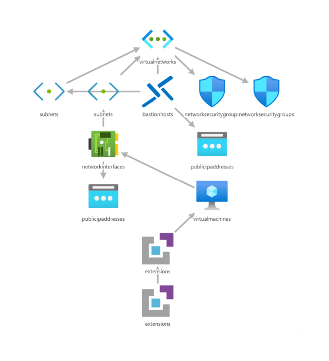

# OBS Studio on Windows 10 GPU VM with Skype, NDI Runtime and OBS-NDI installed - [Azure Bastion Managed]

  

`Tags: Azure, Virtual Machine, OBS, OBS Studio, Streaming VM`

## Solution Overview

This template deploys a Windows GPU VM (Windows 10) with OBS Studio, and Skype Preinstalled. All management of the Streaming VM will be facilitated by Azure Bastion.

## Deployed Resources

Following resources will be created

- Virtual Network
- Public IP Address with DNS
- Network Interface
- Network Security group (with HTTP and SSL port opened)
- Virtual Machine
- Azure Bastion
- Public IP Address with DNS

Notes

- GPU drivers installed via NVIDIA extension for Virtual Machine, more details - <https://docs.microsoft.com/en-us/azure/virtual-machines/windows/n-series-driver-setup>
- Software installation based on custom script extension via chocolatey package manager

*OBS-NDI is isntalling via choco sources, as OBS-NDI official package not yet validated by chocolatey moderators Team - <https://chocolatey.org/packages/obs-ndi/4.9.0>*

Software preinstalled

- Skype - <https://chocolatey.org/packages/skype>
- OBS Studio - <https://chocolatey.org/packages/obs-studio>
- NDI Runtime - <https://ndi.tv/tools/>
- OBS-NDI - <https://github.com/Palakis/obs-ndi/releases>

Allowed VM sizes in template

- Standard_NV6_Promo
- Standard_NV12_Promo
- Standard_NV24_Promo
- Standard_NC6_Promo
- Standard_NC12_Promo
- Standard_NC24_Promo
- Standard_NV6
- Standard_NV12
- Standard_NV24
- Standard_NC6
- Standard_NC12
- Standard_NC24
- Standard_NV6s_v2
- Standard_NV12s_v2
- Standard_NV24s_v2
- Standard_NV12s_v3
- Standard_NV24s_v3
- Standard_NV48s_v3
- Standard_NC6
- Standard_NC12
- Standard_NC24
